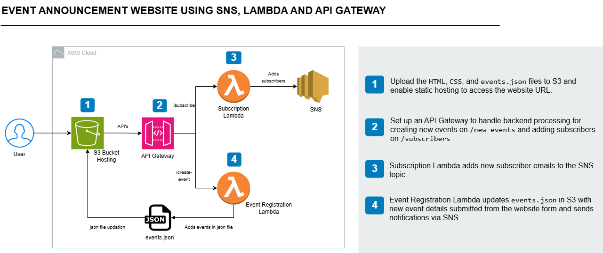

# 📢 Event Announcement System — AWS Serverless Portfolio Project

A **cloud-native event announcement system** built using AWS Serverless architecture. Users can:

- 📬 Subscribe to event notifications via email  
- 🗓️ View a list of upcoming events  
- 📝 Create and announce new events using a web form  

This project demonstrates practical skills in deploying AWS serverless services, including Lambda, S3, SNS, and API Gateway—ideal for showcasing in GitHub, LinkedIn, and Upwork portfolios.

---

## 📁 Folder Structure

```bash
event-announcement-system/
├── architecture/                # Architecture diagram (PNG), event-announcement-architecture-description
├── event-announcement-frontend/ # Frontend files: index.html, styles.css, events.json
├── lambda/                       # Lambda functions (subscribe & event creation)
├── screenshots/                  # UI & AWS console screenshots
└── README.md                     # Project documentation
```

---

## 🛠 AWS Services Used

| Service        | Purpose                                              |
|----------------|------------------------------------------------------|
| **Amazon S3**  | Static website hosting + stores `events.json`       |
| **AWS Lambda** | Backend logic (form handling, SNS, S3 updates)      |
| **API Gateway**| Secure REST APIs: `/subscribe` & `/create-event`    |
| **Amazon SNS** | Email notification and subscriber management        |
| **IAM Roles**  | Secure access policies for Lambda functions         |

---

## 🖼 Architecture Diagram



> *Illustrates S3 frontend, Lambda processing, API Gateway endpoints, and SNS notification flow.*

---

## 🧠 How It Works

1. **Frontend (S3 Static Hosting)**  
   - Users view events and submit the form from `index.html`  
   - Hosted from `event-announcement-frontend/`  

2. **Backend via API Gateway**  
   - `/subscribe` endpoint → Adds user email to SNS topic  
   - `/create-event` endpoint →  
     - Updates `events.json` in S3 with new event  
     - Triggers SNS email to subscribers  

3. **Email Notifications**  
   - SNS sends email to all subscribed users

---

## 🧪 Steps to Deploy

### ✅ Frontend Setup
- Upload contents of `event-announcement-frontend/` to S3  
- Enable static website hosting  

### ✅ SNS Setup
- Create an SNS topic (e.g., `EventAnnouncementTopic`)  
- Add email subscriptions  

### ✅ Lambda Functions
- `lambda/subscribeFunction.py`  
- `lambda/createEventFunction.py`  

### ✅ API Gateway
- POST `/subscribe` → `subscribeFunction`  
- POST `/create-event` → `createEventFunction`  

### ✅ IAM Setup
- Assign policies for:  
  - `sns:Publish`  
  - `s3:GetObject`, `s3:PutObject`

---

## 🖼 Screenshots

> *(Stored in `screenshots/` folder)*

| Frontend UI | AWS Console | All Services Used |

---

## ⏱ Time & 💰 Cost Estimate

| Task                  | Time       | Cost             |
|------------------------|------------|------------------|
| Full Deployment        | 2–3 hours  | Free Tier Eligible |
| Maintenance & Hosting  | Minimal    | Free Tier         |

---

## 🌟 Use This for:

- 💼 **Upwork Portfolio**: Showcase serverless web apps  
- 📢 **LinkedIn Post**: Share your real-world AWS project  
- 👩‍💻 **GitHub Repository**: Clean, documented AWS solution  

---

## 🙋‍♀️ About Me

I'm **Saba Ijaz**, an **AWS Certified Solutions Architect – Associate**, currently working on practical AWS projects to build a strong cloud portfolio. Let’s connect or collaborate!

---

## 📄 License

Free to use for educational and demonstration purposes.

---
